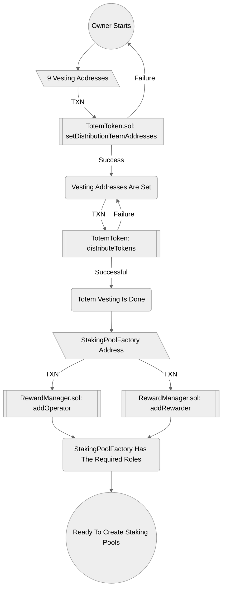
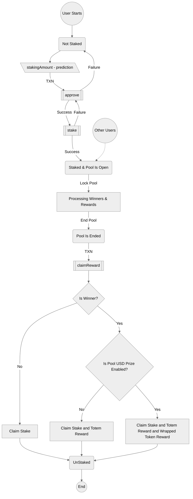
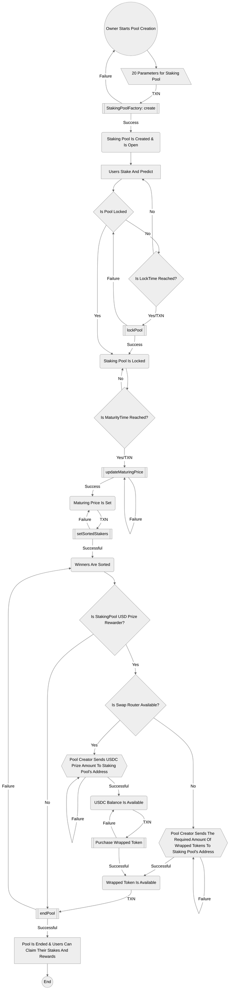

# TotemFi Multi-assets Smart-contracts

This repository consists of smart contracts required for TotemFi Multi-asset DApp with Token contract, Vesting contracts and Staking contracts.

The flow charts provided below are generated with mermaid.js package and can be used to understand the flows of the contracts:

### Admin States


### mermaidjs code to generate this chart:



### User States


### mermaidjs code to generate this chart:


### Staking Pool States


### mermaidjs code to generate this chart:



#### How to run

-   Deploy to testnet (goerli in the below example)

```
yarn
PROJECT_ID="infura id" PRIVATE_KEY"priavete key to deploy the contracts from" yarn deploy:goerli
```

-   Deploy to local (requires ganache to run on local)


You can find more information in the `scripts-info` section in the `package.json` file.


#### How to deploy

-   Deploy to bsc_testnet

```
yarn clean

yarn prepare

NODE_ENV=default PRIVATE_KEY=<your-private-key> yarn deploy:bsc_testnet
```

-   Deploy to bsc mainnet


```
NODE_ENV=production PRIVATE_KEY=<your-private-key> yarn deploy:bsc
```

-   Deploy to Polygon (Matic) mainnet


```
NODE_ENV=polygon_production PRIVATE_KEY=<your-private-key> yarn deploy:matic
```


#### How to verify a contract

- Verify on bsc_testnet

You will first need an API key from your account on https://bscscan.com/login

then run 

```
ETHERSCAN_KEY=<your-api-key> npx hardhat verify --network bsc_testnet <contract-address> "constructor's-first-arg" "constructor's-second-arg" "constructor's-third-arg" "constructor's-forth-arg"
```

#### How to work with smart contracts 

- Information on how to use contracts can be found on the confluence page (the document below should be updated for this new project)

https://totemfi.atlassian.net/wiki/spaces/TP/pages/84574258/Instruction+and+information+for+using+TotemFi+smart+contracts


